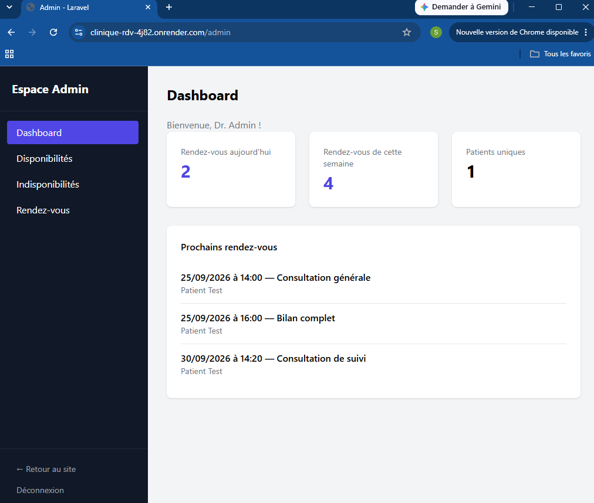

# 🩺 Clinique RDV — Laravel

Une application de prise de rendez-vous en ligne pour une clinique médicale, avec calcul dynamique des créneaux disponibles et un espace d'administration complet.

## 🔗 Démo en ligne

👉 **[Voir le site en ligne](https://clinique-rdv-4j82.onrender.com)**

⚠️ Le site est hébergé sur un plan gratuit : le premier chargement peut prendre 30 à 60 secondes si le site était inactif.

### Identifiants de test

| Rôle | Email | Mot de passe |
|---|---|---|
| Patient | patient@example.com | password |
| Admin (médecin) | medecin@example.com | password |

## ✨ Fonctionnalités

**Côté patient**
- Prise de rendez-vous avec calcul dynamique des créneaux disponibles
- Choix du type de consultation (durée variable selon le type)
- Historique des rendez-vous, avec possibilité d'annulation
- Authentification (inscription / connexion)

**Côté administration**
- Dashboard avec statistiques (rendez-vous du jour/semaine, patients uniques)
- Gestion des disponibilités hebdomadaires via une grille horaire interactive
- Gestion des indisponibilités ponctuelles (congés, absences)
- Planning journalier avec filtrage par date
- Confirmation/annulation des rendez-vous

## 🛠️ Stack technique

- **Backend** : Laravel 12, PHP 8.2
- **Frontend** : Blade, Alpine.js, Tailwind CSS
- **Base de données** : PostgreSQL (Neon)
- **Authentification** : Laravel Breeze
- **Déploiement** : Docker, Render

## 🧠 Choix techniques

- **Calcul de créneaux via un service dédié** (`AppointmentAvailabilityService`) : centralise la logique complexe de croisement entre disponibilités récurrentes, indisponibilités ponctuelles et rendez-vous déjà pris, réutilisable partout où c'est nécessaire.
- **Revérification de la disponibilité au moment de la confirmation** : évite qu'un créneau soit réservé deux fois si deux patients tentent de réserver au même moment.
- **Heure de fin stockée explicitement sur chaque rendez-vous** plutôt que recalculée à partir de la durée du type de consultation, pour ne pas altérer l'historique si la durée d'un type change plus tard.
- **Grille horaire interactive pour les disponibilités admin** : les créneaux cochés sont automatiquement fusionnés en plages continues côté serveur, pour une gestion plus naturelle qu'un formulaire classique.

## 📸 Aperçu




## ⚙️ Installation locale

```bash
git clone https://github.com/zzres/clinique-rdv.git
cd clinique-rdv

composer install
npm install

cp .env.example .env
php artisan key:generate

# Configurer la base de données dans le fichier .env

php artisan migrate --seed
npm run build

php artisan serve
```

## 👤 Auteur

Développé par Alvain Junior Saminzere Zero
Retrouvez-moi sur [Codeur.com](https://www.codeur.com/-alvainz23) pour vos projets de développement web.